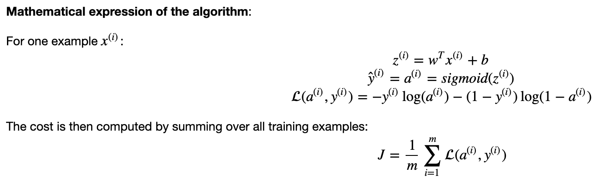

# Math implementation of logistic regression

Python logistic regression (using a perceptron) classifier to recognize cats.




## Installation
- pip:
```bash
pip3 install -r requirements.txt
```

or

- pipenv:
```bash
pipenv install
```

## How to run it
If you're not using `pipenv`
```bash
python3 logistic_regression.py
```
If you're using `pipenv`
```bash
pipenv run python logistic_regression.py
```

## How to test it with a new image
Add your own image in the folder `images`, then go to line 243 in `logistic_regression.py` and replace `my_image_1.jpg` by the name and its extension of the new image, finally run the application again.

## Note
Test accuracy is 70% which is OK for a simple model like this. It uses a small dataset, and not tuning actions were performed over the hyperparameters.